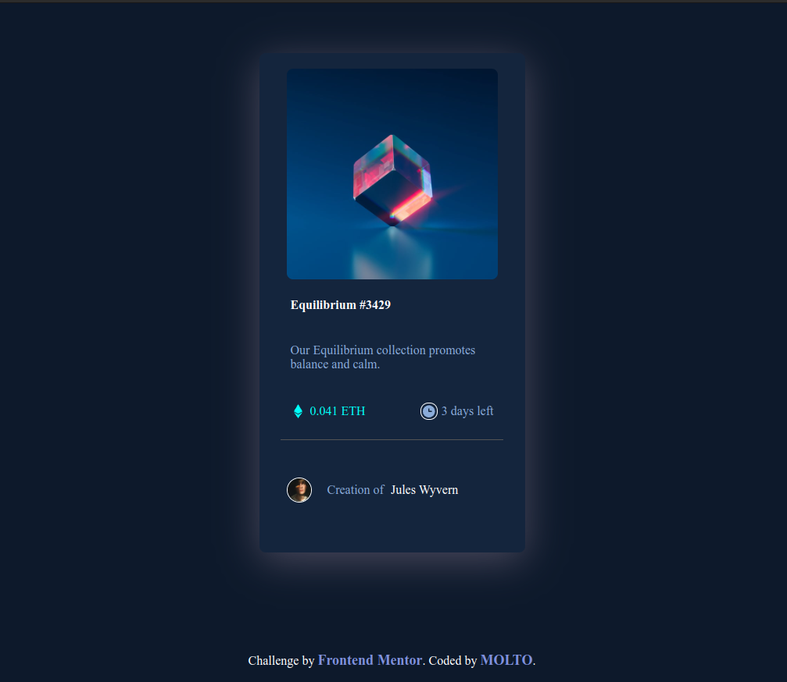

# nft-preview-card# Frontend Mentor - NFT preview card component solution

This is a solution to the [NFT preview card component challenge on Frontend Mentor](https://www.frontendmentor.io/challenges/nft-preview-card-component-SbdUL_w0U). Frontend Mentor challenges help you improve your coding skills by building realistic projects.

## Table of contents

- [Overview](#overview)
  - [The challenge](#the-challenge)
  - [Screenshot](#screenshot)
  - [Links](#links)
  - [Built with](#built-with)
  - [What I learned](#what-i-learned)
  - [Continued development](#continued-development)
- [Author](#author)

## Overview

### The challenge

Users should be able to:

- View the optimal layout depending on their device's screen size
- See hover states for interactive elements

### Screenshot



### Links

- Solution URL: [Add solution URL here](https://your-solution-url.com)
- Live Site URL: [ https://m0lt0.github.io/Nft-preview-card/](https://your-live-site-url.com)

### Built with

- Semantic HTML5 markup
- CSS custom properties
- Flexbox

### What I learned

css

```
.hover-container:hover {
  cursor: pointer;
  opacity: 1;
  transition: ease 0.5s;
  background-color: hsl(178, 100%, 40%);
  background-image: url(/images/icon-view.svg);
  background-repeat: no-repeat;
  background-position: center;
}

```

### Continued development

Use this section to outline areas that you want to continue focusing on in future projects. These could be concepts you're still not completely comfortable with or techniques you found useful that you want to refine and perfect.

## Author

- Website - [molto](https://www.your-site.com)
- Frontend Mentor - [@molto](https://www.frontendmentor.io/profile/M0lt0)
